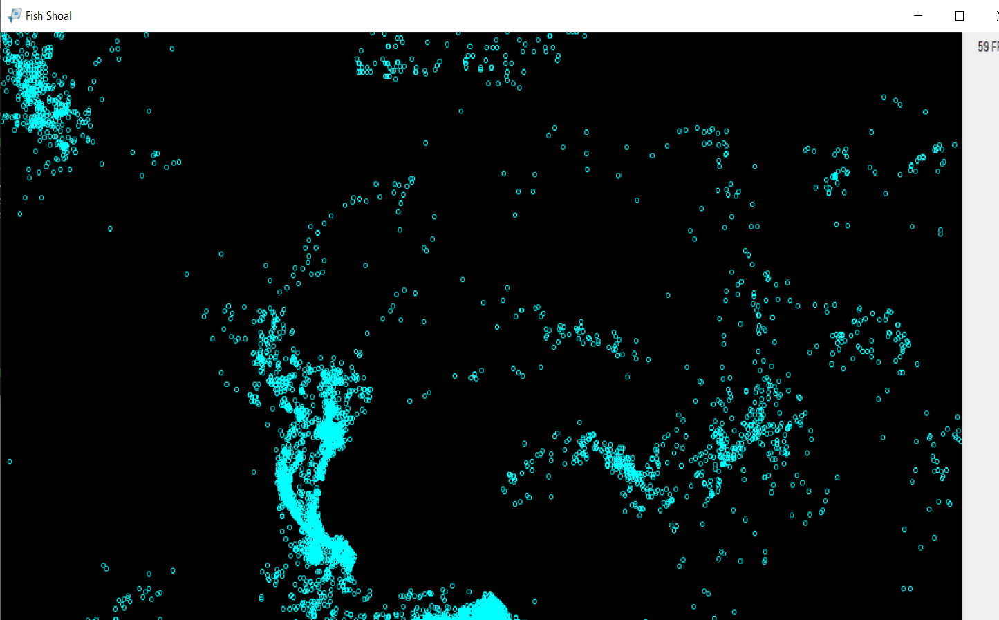

# FishShoal
FishShoal is a program written in .NET Framework 4.7.2 (using C# 7.3). It simulates a fish shoal using 3 principles discribed by Craig Reynolds [here](https://www.red3d.com/cwr/boids/)

## Features
- fish run away from the cursor
- displays FPS
- works for up to 2 milion fish
- uses spacial data structures and drawing on GPU side for optimalization

## About Project
Written with Visual Studio 2017 with Alea. Compiled with .NET Framework 4.7.2.
